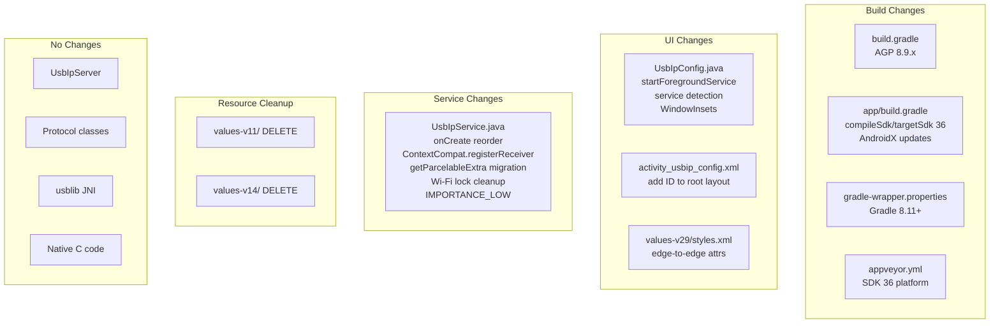

# Design Document: Android 16 Compatibility

## Overview

This design covers the changes required to update USBIPServerForAndroid from targeting API 34 (Android 14) to API 36 (Android 16). The update spans build toolchain upgrades, AndroidX dependency bumps, mandatory behavioral changes (edge-to-edge display, foreground service timing), deprecated API migration, and CI pipeline adjustments.

The app is a single-activity, single-service Android application with a JNI layer. The core USB/IP server logic, protocol handling, and native code require no functional changes — the work is concentrated in the build configuration, the `UsbIpService` foreground service lifecycle, the `UsbIpConfig` activity, and resource files.

### Design Principles

- **Minimal diff**: Change only what's required for API 36 compliance. Don't refactor unrelated code.
- **Backward compatibility**: All changes must be version-gated to preserve behavior on API 21–34.
- **No new dependencies**: Continue the project's policy of avoiding third-party libraries. All changes use AndroidX or platform APIs.
- **Java only**: No Kotlin. Maintain existing code style (tabs, same-line braces).

## Architecture

The existing architecture layers are unchanged by this update:

```
UI (UsbIpConfig) → Service (UsbIpService) → Server (UsbIpServer) → Protocol → USB/JNI
```

Changes are localized to:

1. **Build layer**: `build.gradle`, `gradle-wrapper.properties`, `app/build.gradle`, `appveyor.yml`
2. **UI layer**: `UsbIpConfig.java`, `activity_usbip_config.xml`, `values-v*/styles.xml`
3. **Service layer**: `UsbIpService.java` (onCreate reordering, API migration, notification channel)
4. **Resources**: Dead directory cleanup

No changes to the server, protocol, USB, JNI, or native C layers.



## Components and Interfaces

### Component 1: Build Configuration

**Files**: `build.gradle`, `app/build.gradle`, `gradle-wrapper.properties`

**Changes**:

| Property | Current | Target |
|---|---|---|
| AGP | 8.5.1 | 8.9.1 |
| Gradle | 8.7 | 8.11.1 |
| compileSdk | 34 | 36 |
| targetSdk | 34 | 36 |
| minSdk | 21 | 21 (unchanged) |
| androidx.core:core | 1.13.1 | 1.16.0 |
| androidx.activity:activity | 1.9.1 | 1.10.1 |

**Rationale**:
- AGP 8.9.x is the minimum version that supports `compileSdk 36`. AGP 8.9.1 is the latest stable in the 8.9 line.
- AGP 8.9.x requires Gradle 8.11+. Gradle 8.11.1 is the compatible stable release.
- The Kotlin stdlib exclusion in `configurations.implementation` remains unchanged.
- NDK version 27.0.12077973 is compatible with AGP 8.9.x — no NDK change needed.

### Component 2: UsbIpService — Foreground Service Lifecycle Reorder

**File**: `UsbIpService.java`

**Current `onCreate()` order**:
1. Init fields (usbManager, connections, permission, socketMap)
2. Register broadcast receiver
3. Acquire wake lock
4. Acquire Wi-Fi locks
5. Start TCP server (`server.start(this)`)
6. Create notification channel
7. Call `startForeground()` via `updateNotification()`

**New `onCreate()` order**:
1. Init fields
2. Create notification channel
3. **Call `startForeground()` via `updateNotification()`** ← moved up
4. Register broadcast receiver (via `ContextCompat.registerReceiver()`)
5. Acquire wake lock
6. Acquire Wi-Fi locks (version-gated)
7. Start TCP server

**Rationale**: Android 14+ enforces a strict ~10-second timeout for `startForeground()` after service creation. The current code does server startup and lock acquisition before calling `startForeground()`, which risks hitting the timeout. Moving `startForeground()` to immediately after field init and channel creation ensures compliance.

**Exception handling**: Wrap the `startForeground()` call path in a try-catch for `ForegroundServiceStartNotAllowedException` (API 31+) and `InvalidForegroundServiceTypeException` (API 34+). On catch, log the error and call `stopSelf()`.

### Component 3: UsbIpService — Broadcast Receiver Registration

**File**: `UsbIpService.java`

**Current code**:
```java
@SuppressLint({"UseSparseArrays", "UnspecifiedRegisterReceiverFlag"})
// ...
if (Build.VERSION.SDK_INT >= Build.VERSION_CODES.TIRAMISU) {
    registerReceiver(usbReceiver, filter, RECEIVER_NOT_EXPORTED);
} else {
    registerReceiver(usbReceiver, filter);
}
```

**New code**: Replace with single call:
```java
ContextCompat.registerReceiver(this, usbReceiver, filter, ContextCompat.RECEIVER_NOT_EXPORTED);
```

Remove `"UnspecifiedRegisterReceiverFlag"` from the `@SuppressLint` annotation (keep `"UseSparseArrays"`).

### Component 4: UsbIpService — Wi-Fi Lock Cleanup

**File**: `UsbIpService.java`

**Current behavior**: Acquires BOTH `WIFI_MODE_FULL_HIGH_PERF` and `WIFI_MODE_FULL_LOW_LATENCY` on API 29+.

**New behavior**:
- API 29+: Acquire only `WIFI_MODE_FULL_LOW_LATENCY` (supersedes HIGH_PERF)
- API < 29: Acquire only `WIFI_MODE_FULL_HIGH_PERF` (LOW_LATENCY unavailable)

**`onDestroy()` cleanup**: Release whichever lock was acquired. Since only one will be non-null at a time, check for null before releasing each.

### Component 5: UsbIpService — Deprecated getParcelableExtra

**File**: `UsbIpService.java`

**Current code** (in `usbReceiver.onReceive`):
```java
UsbDevice dev = (UsbDevice)intent.getParcelableExtra(UsbManager.EXTRA_DEVICE);
```

**New code**:
```java
UsbDevice dev;
if (Build.VERSION.SDK_INT >= Build.VERSION_CODES.TIRAMISU) {
    dev = intent.getParcelableExtra(UsbManager.EXTRA_DEVICE, UsbDevice.class);
} else {
    dev = intent.getParcelableExtra(UsbManager.EXTRA_DEVICE);
}
```

### Component 6: UsbIpService — Notification Channel Importance

**File**: `UsbIpService.java`

**Change**: Replace `NotificationManager.IMPORTANCE_DEFAULT` with `NotificationManager.IMPORTANCE_LOW` in the `NotificationChannel` constructor.

**Rationale**: `IMPORTANCE_DEFAULT` can produce sound. Although `setSilent(true)` is set on the notification builder, on newer Android versions the channel importance takes precedence. `IMPORTANCE_LOW` ensures no sound/vibration while still displaying the notification in the shade.

### Component 7: UsbIpConfig — Service Launch

**File**: `UsbIpConfig.java`

**Current code**: Uses `startService()` everywhere.

**New code**: Version-gated helper method:
```java
private void launchService() {
    Intent intent = new Intent(this, UsbIpService.class);
    if (Build.VERSION.SDK_INT >= Build.VERSION_CODES.O) {
        startForegroundService(intent);
    } else {
        startService(intent);
    }
}
```

Replace both `startService(new Intent(...))` calls (in `onClick` and in `requestPermissionLauncher` callback) with `launchService()`.

### Component 8: UsbIpConfig — Service Running Detection

**File**: `UsbIpConfig.java`

**Current code**: Uses `ActivityManager.getRunningServices()` which is deprecated and unreliable on API 26+.

**Replacement strategy**: Use a static `volatile boolean` field on `UsbIpService` that is set to `true` in `onCreate()` and `false` in `onDestroy()`. The activity reads this field directly.

```java
// In UsbIpService.java
public static volatile boolean isRunning = false;

// Set true at start of onCreate(), false at start of onDestroy()
```

```java
// In UsbIpConfig.java
private boolean isMyServiceRunning() {
    return UsbIpService.isRunning;
}
```

**Rationale**: This is the simplest approach that avoids deprecated APIs, doesn't require binding, and works across all API levels. The `volatile` keyword ensures visibility across threads. Since there's only ever one instance of the service, a static field is appropriate.

### Component 9: UsbIpConfig — Edge-to-Edge Display

**File**: `UsbIpConfig.java`, `activity_usbip_config.xml`

**Strategy**: On API 35+, Android enforces edge-to-edge. The activity must apply `WindowInsets` to its root layout so content doesn't draw behind system bars.

**Layout change**: Add an `android:id` to the root `RelativeLayout`:
```xml
<RelativeLayout
    android:id="@+id/rootLayout"
    ...>
```

**Activity change**: In `onCreate()`, after `setContentView()`, apply a `WindowInsetsListener` on API 35+:

```java
if (Build.VERSION.SDK_INT >= 35) {
    View rootLayout = findViewById(R.id.rootLayout);
    ViewCompat.setOnApplyWindowInsetsListener(rootLayout, (v, windowInsets) -> {
        Insets insets = windowInsets.getInsets(WindowInsetsCompat.Type.systemBars());
        v.setPadding(insets.left, insets.top, insets.right, insets.bottom);
        return WindowInsetsCompat.CONSUMED;
    });
}
```

On API 34 and below, the existing fixed-padding behavior from `dimens.xml` is preserved.

**Style changes**: Add `values-v35/styles.xml` to opt into edge-to-edge cleanly:
```xml
<resources>
    <style name="AppBaseTheme" parent="android:Theme.Material">
        <item name="android:navigationBarColor">@android:color/transparent</item>
        <item name="android:statusBarColor">@android:color/transparent</item>
    </style>
</resources>
```

This inherits the v29 transparent bars approach and ensures it's active on API 35+ where edge-to-edge is enforced.

### Component 10: CI Pipeline

**File**: `appveyor.yml`

**Changes**:
- Ensure Android SDK platform 36 and corresponding build-tools are available. AppVeyor's Android SDK images may not include API 36 by default, so add an `sdkmanager` install step.
- JDK 17 remains compatible with AGP 8.9.x — no JDK change needed.

### Component 11: Dead Resource Cleanup

**Directories to delete**:
- `app/src/main/res/values-v11/` (defines `AppBaseTheme` for API 11+ using `Theme.Holo` — unreachable since minSdk is 21)
- `app/src/main/res/values-v14/` (defines `AppBaseTheme` for API 14+ using `Theme.Holo` — unreachable since minSdk is 21)

Theme resolution chain after cleanup: `values/styles.xml` (base) → `values-v21/styles.xml` → `values-v24/styles.xml` → `values-v29/styles.xml` → `values-v35/styles.xml` (new).

### Component 12: NDK and Native Library

**No code changes required.**

- `APP_SUPPORT_FLEXIBLE_PAGE_SIZES := true` is already set in `Application.mk`
- `APP_ABI := all` is already set
- NDK 27.0.12077973 is compatible with AGP 8.9.x
- The `usblib` JNI library uses standard Linux ioctl calls (`USBDEVFS_BULK`, `USBDEVFS_CONTROL`) which are stable kernel interfaces unaffected by Android API level changes
- No page-alignment issues expected since flexible page sizes are already enabled

## Data Models

No data model changes. The USB/IP wire protocol, device descriptors, and internal state structures (`AttachedDeviceContext`, `SparseArray<Boolean> permission`, etc.) are unaffected by this update.

The only state addition is the `public static volatile boolean isRunning` field on `UsbIpService`, which is a simple boolean flag, not a data model.


## Correctness Properties

*A property is a characteristic or behavior that should hold true across all valid executions of a system — essentially, a formal statement about what the system should do. Properties serve as the bridge between human-readable specifications and machine-verifiable correctness guarantees.*

### Property 1: WindowInsets-to-padding mapping

*For any* set of system bar insets (top, bottom, left, right) reported by the system on API 35+, the root layout's padding after the `OnApplyWindowInsetsListener` callback shall equal those inset values exactly.

**Validates: Requirements 4.2**

### Property 2: Service running flag consistency

*For any* sequence of `onCreate()` and `onDestroy()` calls on `UsbIpService`, the static `isRunning` flag shall be `true` if and only if `onCreate()` was the most recent lifecycle call (i.e., `onCreate()` sets it to `true`, `onDestroy()` sets it to `false`, and the flag always reflects the current state).

**Validates: Requirements 7.1**

### Property 3: Wi-Fi lock exclusivity by API level

*For any* Android API level, the service shall acquire exactly one Wi-Fi lock: `WIFI_MODE_FULL_LOW_LATENCY` when the API level is 29 or higher, and `WIFI_MODE_FULL_HIGH_PERF` when the API level is below 29. The two lock types shall never be held simultaneously.

**Validates: Requirements 7.3, 7.4**

## Error Handling

### Foreground Service Start Failures

On API 31+, `startForeground()` can throw `ForegroundServiceStartNotAllowedException` if the app is not allowed to start a foreground service (e.g., background launch restrictions). On API 34+, `InvalidForegroundServiceTypeException` can be thrown if the foreground service type doesn't match the manifest.

**Strategy**: Wrap the `startForeground()` call in `onCreate()` with a try-catch:
- Catch `ForegroundServiceStartNotAllowedException` (API 31+): Log the error via `System.err.println`, call `stopSelf()`.
- Catch `InvalidForegroundServiceTypeException` (API 34+): Log the error, call `stopSelf()`.
- The manifest already declares `foregroundServiceType="specialUse"` and the `FOREGROUND_SERVICE_SPECIAL_USE` permission, so `InvalidForegroundServiceTypeException` should not occur in practice.

### Wi-Fi Lock Acquisition

No new error handling needed. `WifiManager.createWifiLock()` and `WifiLock.acquire()` don't throw checked exceptions. The version gating ensures only valid lock modes are used on each API level.

### Notification Channel

`NotificationManager.createNotificationChannel()` is idempotent — calling it with the same channel ID but different importance has no effect after the first creation. Users who upgrade from the old APK will retain `IMPORTANCE_DEFAULT` until they clear app data or manually change the channel settings. This is expected Android behavior and not an error condition.

### Build Failures

If the AGP/Gradle upgrade introduces compilation errors due to API changes in SDK 36, these will surface as standard build errors. No runtime error handling is needed — these are caught at build time.

## Testing Strategy

### Constraints

This project has no unit test infrastructure. Testing is done via `./gradlew build connectedCheck` (instrumented tests on device/emulator) and manual testing with a USB/IP client. The codebase deliberately avoids third-party libraries.

Given these constraints, the testing strategy is primarily manual and CI-based, with specific verification steps for each requirement.

### Build Verification Tests (CI)

These verify requirements 1, 2, 3, 8, 9:

1. `./gradlew assembleDebug` — confirms the project compiles with SDK 36, AGP 8.9.x, and updated dependencies
2. `./gradlew lint` — confirms no new lint errors from the SDK/dependency upgrade
3. `./gradlew build connectedCheck` — full CI validation (if connected device available)

**Verification checklist**:
- APK is produced without errors
- Lint report shows no new warnings related to the changes
- Kotlin stdlib is not present in the dependency tree (`./gradlew app:dependencies | grep kotlin` should return nothing)

### Manual Verification Tests

#### Foreground Service Timing (Requirement 5)
- Install APK on an API 34+ device
- Start the service via the UI button
- Verify the notification appears immediately (within 1-2 seconds)
- Check logcat for any `ForegroundServiceStartNotAllowedException`

#### Service Launch Method (Requirement 6)
- On API 26+ device: start service, verify no `Context.startForegroundService() did not then call Service.startForeground()` crash
- On API < 26 device/emulator: start service, verify it starts normally

#### Edge-to-Edge (Requirement 4)
- On API 35+ device/emulator: launch activity, verify text and button are not behind status bar or navigation bar
- On API 34 device/emulator: launch activity, verify layout looks the same as before (fixed padding)
- Rotate device to landscape, verify insets are reapplied correctly

#### Deprecated API Migration (Requirement 7)
- Start/stop service multiple times, verify the button state correctly reflects service status (tests `isRunning` flag)
- Attach a USB device via USB/IP client, verify USB permission dialog appears (tests `getParcelableExtra` migration)
- Verify Wi-Fi lock behavior via `dumpsys wifi` — only one lock type should be held

#### Notification (Requirement 11)
- Fresh install on API 26+ device: start service, verify notification appears silently (no sound/vibration)
- Upgrade install from old APK: note that channel importance may be cached — this is expected

#### Broadcast Receiver (Requirement 10)
- Attach USB device, verify permission prompt appears (confirms receiver is working)
- No lint warnings about `UnspecifiedRegisterReceiverFlag`

#### Dead Resource Cleanup (Requirement 12)
- Build succeeds (confirms no missing resource references)
- Theme renders correctly on API 21+ device

### Property-Based Testing

Given the project's constraint of no unit test infrastructure and no third-party libraries, the three correctness properties identified above would require adding a test framework. If property-based testing were to be added in the future:

- **Library**: JQwik (JUnit 5 property-based testing for Java) or a minimal custom generator
- **Minimum iterations**: 100 per property
- **Tag format**: `Feature: android-16-compatibility, Property {number}: {property_text}`

**Property 1 (WindowInsets-to-padding)**: Generate random Insets objects with values 0–200 for each edge. Apply the listener callback. Assert padding matches insets.

**Property 2 (Service running flag)**: Generate random sequences of `onCreate`/`onDestroy` calls. After each call, assert `isRunning` matches expected state.

**Property 3 (Wi-Fi lock exclusivity)**: Generate random API levels (21–36). For each, simulate the version-gated lock acquisition logic. Assert exactly one lock type is selected, and it's the correct one for the API level.

In practice, these properties are simple enough that they are effectively verified by the manual testing steps above and code review of the version-gating logic. The properties are documented here to formalize the expected behavior.
